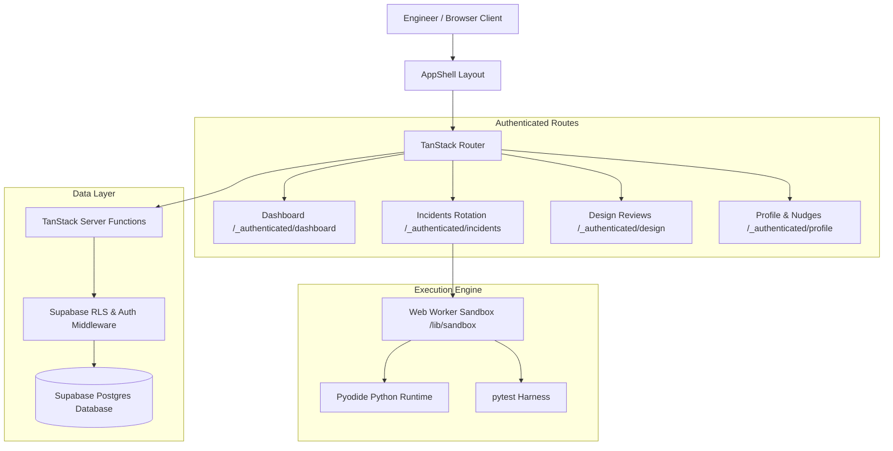

# Groundwork Engineering Platform Architecture

## Overview

Groundwork is an interactive engineering platform designed for practicing software debugging under on-call conditions and presenting stage-by-stage system architecture designs under stakeholder review.

## System Architecture



## Core Components

### 1. App Shell (`src/components/AppShell.tsx`)

- Provides sticky, glassmorphic global navigation across all authenticated routes.
- Renders track navigation links (`Incidents`, `Design Reviews`), user profiles, active nudges popover, and centralized sign-out.
- Integrated at the root layout boundary `src/routes/_authenticated/route.tsx`.

### 2. Python Web Worker Sandbox (`src/lib/sandbox/`)

- Executes user Python code safely in the browser using **Pyodide** Web Workers.
- Isolates test execution from the main UI thread to prevent UI freezing.
- Runs hidden pytest test suites and streams test outcome cases back to the main thread.
- Includes error handling and automatic state cleanup on worker failure.

### 3. Server Functions & Auth Middleware (`src/lib/*.functions.ts`, `src/integrations/supabase/`)

- All database queries execute via TanStack Start `createServerFn` with `requireSupabaseAuth` middleware.
- Enforces Row-Level Security (RLS) and scope filtering by matching authenticated `context.userId` on all queries.
- Prevents cross-user data exposure in nudges, progress tracking, and design stage evaluations.

### 4. Interactive Design Review Canvas (`src/components/design/`)

- Four-stage evaluation engine:
  1. **Clarify Requirements**: Functional & non-functional scope constraints.
  2. **Capacity Estimation**: Throughput, storage, and bandwidth arithmetic.
  3. **Component Canvas**: Visual typed diagram graph builder with automated rule evaluation.
  4. **Trade-Off Defense**: Interactive trade-off defense rubric.

## Directory Structure

```
├── .github/workflows/       # CI/CD GitHub Actions
├── src/
│   ├── components/          # Reusable UI components & AppShell
│   │   ├── design/          # System design review canvas & stage tools
│   │   └── ui/              # Radix/shadcn primitive UI components
│   ├── content/             # Scenario definitions & design review rubrics
│   │   ├── design/          # System design review stage content
│   │   └── scenarios/       # Debugging code scenarios & hidden tests
│   ├── integrations/        # Supabase client & auth middleware
│   ├── lib/                 # Core functions & Web Worker sandbox
│   │   └── sandbox/         # Pyodide worker test execution runner
│   └── routes/              # TanStack file-based routes
│       └── _authenticated/  # AppShell-wrapped protected routes
```

## Security & Compliance

- **Auth Tokens**: Server functions execute with attached user bearer tokens via `attachSupabaseAuth`.
- **Query Scoping**: Server functions filter user data explicitly via `eq("user_id", context.userId)`.
- **Sandbox Isolation**: Pyodide runs in a Web Worker thread without access to DOM or sensitive local storage data.
